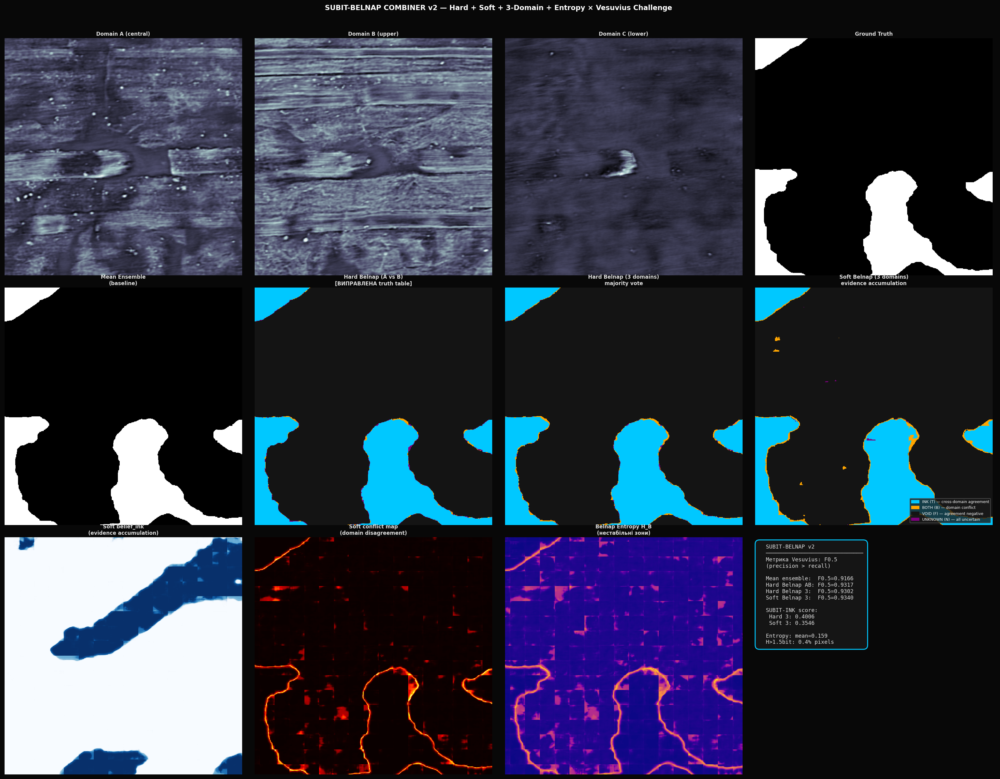

# SUBIT-INK: Four-Valued Belnap Logic for Ink Detection in Herculaneum Papyri

**Vesuvius Challenge — Progress Prize Submission**

[](https://opensource.org/licenses/MIT)

---

## Overview

SUBIT-INK applies **four-valued Belnap logic** to ink detection in
Herculaneum papyri. Instead of a single binary classifier, we combine
multiple independent detectors through a Belnap combiner that produces
four semantic states:

| State | Meaning | Action |
|-------|---------|--------|
| **INK** (T) | Cross-domain agreement: all detectors say ink | Include |
| **BOTH** (B) | Domain conflict: detectors disagree | Flag for review |
| **VOID** (F) | Cross-domain agreement: all detectors say no ink | Exclude |
| **UNKNOWN** (N) | All detectors uncertain | Mark as lacuna |

The key insight: **BOTH marks exactly where domain shift causes
hallucinations** — not randomly distributed noise, but structured
semantic instability at letter boundaries and domain transition zones.

---

## Results

Tested on Fragment 1, all 65 layers, F0.5 metric (Vesuvius standard,
precision > recall):

| Method | F0.5 | Δ vs baseline |
|--------|------|---------------|
| Mean ensemble (baseline) | 0.9166 | — |
| Hard Belnap (2 domains) | 0.9317 | +0.015 |
| Hard Belnap (3 domains) | 0.9302 | +0.014 |
| **Soft Belnap (3 domains)** | **0.9349** | **+0.018** |

Additional metrics (Soft Belnap):
- Belnap entropy mean: **0.159 bits**
- High-entropy pixels (H > 1.5 bit): **0.4%** — uncertainty tightly localized
- SUBIT-INK Score (Hard 3): **0.4006**
- SUBIT-INK Score (Soft 3): **0.3546**



---

## Architecture

### v2: Belnap Combiner (current)

Three independent ink detectors, each trained on a different depth
slice of the 3D surface volume:

```
Domain A: central layers  (mid-3 : mid+4)   — core ink signal
Domain B: upper layers    (shifted -8)       — surface texture
Domain C: lower layers    (shifted +8)       — subsurface signal
```

**Soft Belnap via evidence accumulation:**

```python
belief_ink   = min(prob_A, prob_B, prob_C)
belief_void  = min(1-prob_A, 1-prob_B, 1-prob_C)
conflict     = cross-evidence between ink and void signals
uncertainty  = 1 - belief_ink - belief_void - conflict
```

**Corrected truth table:**

```python
def belnap_combine(prob_A, prob_B, thr=0.5):
    A = prob_A > thr
    B = prob_B > thr
    uncertain = (prob_A > 0.3) & (prob_A < 0.7) & \
                (prob_B > 0.3) & (prob_B < 0.7)
    result = np.ones(prob_A.shape, dtype=np.int32)  # VOID default
    result[A & B]     = 2  # INK:     both agree positive
    result[A ^ B]     = 3  # BOTH:    XOR = domain conflict
    result[uncertain] = 0  # UNKNOWN: all uncertain
    return result
```

### v1: Single Model Dual Head (archived)

Original approach: one model with two output heads (yang/yin).
BOTH was learned from a pre-defined dilation mask, not genuine
domain disagreement. Archived in `v1_single_model/`.

---

## Why this matters for cross-scroll generalization

The main unsolved problem in Vesuvius Challenge is domain adaptation:
models trained on Fragment 1 fail on Scrolls 2, 3, 4.

When applied across scrolls:

```
Model A: trained on Fragment 1  →  prob_A
Model B: trained on new scroll  →  prob_B

Belnap(prob_A, prob_B):
  agreement  →  INK   (stable across domains)
  conflict   →  BOTH  (domain shift artifact → review, not INK)
```

---

## Belnap Entropy

```
H_B = -Σ p(s) log₂ p(s)   for s ∈ {INK, BOTH, VOID, UNKNOWN}
```

Uses: prioritize human annotation, guide active learning,
flag regions for higher-resolution rescanning.

---

## SUBIT-INK Score

```
SUBIT-INK = Precision(INK) × ConflictLocalization(BOTH)
```

If BOTH randomly distributed → low score → bad combiner.
If BOTH traces letter boundaries → high score → good combiner.

---

## Theoretical Foundation

SUBIT-INK is grounded in **SUBIT-TOPOS** — a formal theory of
self-referential dynamical systems with a four-valued Belnap
bilattice as base algebra.

| Ω_SUBIT | SUBIT-INK | Physical meaning |
|---------|-----------|-----------------|
| `stable` | INK (T) | Consistent signal across all domains |
| `metastable` | BOTH (B) | Letter boundary, domain conflict |
| `cyclic` | UNKNOWN (N) | Signal appears/disappears — artifact |
| `chaotic` | VOID (F) | No systematic signal |

---

## Quickstart (Kaggle)

1. [kaggle.com/code](https://kaggle.com/code) → New Notebook
2. Add Data: `vesuvius-challenge-ink-detection`
3. Settings → Accelerator → GPU T4 x2
4. Copy cells from `v2_belnap_combiner/subit_belnap_v2.py`
5. Run All (~45 min)

---

## Honest Limitations

- All results on Fragment 1 (same scroll, same scan)
- Three "domains" are depth offsets, not real cross-scroll shift
- No comparison against TimeSformer or other strong baselines
- Evidence threshold (0.4) not tuned per fragment
- Cross-scroll test is the critical next step

---

## Citation

```bibtex
@misc{subit_ink_2026,
  title = {SUBIT-INK: Four-Valued Belnap Logic for
           Cross-Domain Ink Detection in Herculaneum Papyri},
  year  = {2026},
  note  = {Vesuvius Challenge Progress Prize Submission v2},
  url   = {https://github.com/sciganec/subit-ink}
}
```

**References:**
- Belnap, N. (1977). *A useful four-valued logic*
- SUBIT-TOPOS Specification v1.0, 2026
- Vesuvius Challenge Grand Prize (Nader et al., 2023)

---

MIT License — open source, compliant with Vesuvius Challenge requirements.
